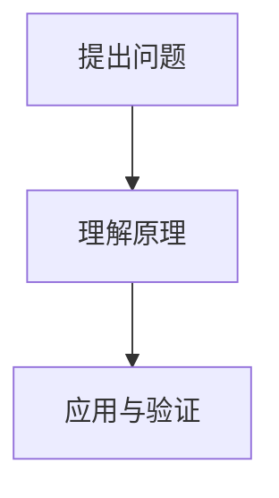

# Knovo 使用指南

[返回中文 README](../README.md) · [English](../README.en.md)

本地运行的个人学习网站。SQLite 统一保存正文、元信息、索引、回收站、编辑历史、新增事件和复习记录；Markdown 保留为正文语法与导入导出格式。两个通用 skill 分别负责导出与增量维护；网站不调用模型，不需要 API Key。skill 由你选择的 AI agent 执行，可能将你提供的内容发送给该 agent 的模型服务。

## 启动

需要 Node.js 24+。首次：

```sh
pnpm install --frozen-lockfile
pnpm run build
pnpm start
```

打开 http://127.0.0.1:3210 。后续只需要 `pnpm start`。开发使用 `pnpm run dev`，页面位于 http://127.0.0.1:5173 。默认仅监听本机；部署配置见 [部署说明](../deploy/README.md)。网站没有登录认证，不应直接暴露公网。

`pnpm run start:local` 强制仅本机访问，`pnpm run start:lan` 开放局域网访问；后者没有登录认证，能访问端口的设备都能读写知识库。两种模式保留端口和知识目录配置。

默认知识目录为项目下的 `content/`，可用 `KNOWLEDGE_DIR=/你的目录 pnpm start` 指定；端口由 `PORT` 控制。SQLite 使用 Node 自带的 `node:sqlite`，无需安装数据库。Node 24 可能输出实验性 API 提示，不影响本项目已验证的功能。

`pnpm run demo` 可生成 7 篇带“示例”标签的演示笔记，文件 ID 以 `demo-` 开头。这些是产品示例，可用于体验功能；可在网站中移入回收站。新下载的项目默认没有笔记，示例需要手动生成。

## 日常使用

界面采用黑白灰配色。桌面端拖动左侧栏右边缘可调整宽度（220–420px），刷新后保留；双击边缘重置，也可聚焦边缘后用左右方向键调整。手机端仍使用抽屉。

分类筛选按层级逐级进入，支持直接搜索分类路径；关键词面板优先展示当前分类下的常用词，可搜索和继续展开。已选条件在列表上方显示，可单独移除。

知识点详情页的“删除知识点”会将记录移入 SQLite 回收站；可从左侧底部“回收站”恢复，保留原 ID、复习进度和首次入库记录。不提供永久清空；同 ID 或原路径被占用时拒绝覆盖。删除不会级联删除相关知识；概念关联按当前有效知识重新计算。回收站包含在知识目录的完整备份中。

- 导出 skill 生成标准 `.md` 后，在页面拖拽/选择导入。导入、编辑和删除统一写入 SQLite；迁移后不再监听散落 Markdown，页面约两秒内刷新。
- 一个知识点一个稳定 ID。改名、移动目录不改 ID；更新同 ID 保留复习状态。
- 主分类支持任意深度；跨分类联系放在元信息 `knowledge_keywords` / `dependency_keywords`，右侧侧栏和知识网络自动显示。
- 热力图按 Markdown 中 `learning_events.date` 的实际学习日期统计，同一天同一知识点只计一次；同一知识点在不同日期学习可分别计数，因此累计次数可能大于知识点总数。日期未知的事件不冒充导入当天。点击方块显示同口径的当天知识点；日期修正后自动重算。删除保留历史，合并后的同一天相同身份去重。首次入库审计记录独立保留，不用于学习热力图。
- 时间线使用 `learning_events` 的真实学习日期，与入库日期分开。
- 新笔记的首次复习从次日开始，每天最多安排 10 篇首次复习。间隔为 1/3/7/14/30/60 天；没掌握重置，模糊保持，掌握推进。可暂停、恢复或立即复习。
- 文本搜索支持中英文连续片段、多词 AND、分类及关键词筛选；没有语义搜索。知识网络默认当前节点两跳、最多 100 个，可按批展开（上限 1000）或切换中心。

页面顶部「新建知识点」打开全屏编辑器；知识详情中的「编辑知识点」修改已有记录。新建时先用表单填写标题、简介、分类、关键词、状态和学习记录，再进入正文编辑；编辑已有知识点可随时切换「基本信息」。左侧只编辑 Markdown 正文，右侧实时渲染，双向按滚动比例同步。保存时自动生成 YAML 文件头，并保留 ID、创建时间、别名等未编辑字段。保存会校验协议、自动更新修改时间、在数据库内保存旧版本，并验证读取时的内容指纹；并发冲突不会覆盖。已有 ID、创建时间与复习进度保持不变。取消未保存修改会提示，刷新或关闭页面也会提示；草稿不自动保存。

「批量导出」按学习日期（默认）、创建日期或修改日期选择闭区间，每个知识点仅导出一次；未知学习日期不匹配学习日期筛选。下载的 ZIP 包含完整 Markdown 与版本化清单，保留 ID、分类、标签、学习事件和概念关键词；不会自动扩展到范围外的关联目标，不迁移 SQLite、回收站或复习进度。新设备会根据已导入知识重新匹配概念关联，新知识按目标设备的规则安排复习。

「导入知识」同一入口支持多个 `.md` 或本系统生成的 `.zip`，可混选。Markdown 沿用同 ID 更新（在数据库内保存旧版本）的行为；ZIP 先校验整包格式、ID、哈希和大小，相同内容跳过，同 ID 不同内容或回收站冲突逐项报告，不覆盖本地版本。有效包的各项独立导入，失败项保留错误明细，可修复后重试。每个 Markdown 最多 2 MB，每包最多 1000 篇、20 MB 正文；ZIP 文件最多 100 MB。

原始 HTML 不执行，外部图片显示为链接，插入的本地图片直接显示；不自动下载附件。

## 两个可移植 skill

源文件在 `skills/knowledge-export/` 与 `skills/knowledge-maintain/`。运行：

```sh
pnpm run package:skills
```

如需安装到本机 Codex，可执行 `pnpm run install:skills`，它会打包、复制并安装辅助脚本依赖；已有同名 skill 不覆盖。

产出 `artifacts/skills/knowledge-export/` 和 `artifacts/skills/knowledge-maintain/`，每个目录都包含 SKILL.md、协议和独立运行时，可整个复制到其他 agent 的技能目录。默认 Codex 个人目录是 `~/.codex/skills/`；若设置 CODEX_HOME，则使用其 `skills/`。不要只复制 SKILL.md。

复制后在每个 skill 的 `scripts/runtime/` 中运行 `pnpm install --prod`。两个 skill 不需要网站运行；辅助脚本支持独立 Markdown 库和 SQLite 知识库。可以在对话里直接提供该 SKILL.md 路径；安装发现后也可用 `$knowledge-export` / `$knowledge-maintain`。

导出示例：

> 使用 knowledge-export，把这次关于 Agent 工具调用的讨论拆成可独立复习的知识点，输出到指定目录。有现成知识索引时复用目录与 ID。

维护示例：

> 使用 knowledge-maintain，增量维护 `/绝对路径/content`，只处理本次变化及其有限候选，不整理全库。

首次维护只建基线，不改已有正文。想立即处理指定文件时明确提供文件列表。每次最多 20 个变化、每项最多 10 个候选；剩余内容留到下次调用。确定性脚本管理扫描、校验、指纹、写锁、备份和恢复；语义判断、拆分与事实核验由调用 skill 的 agent 完成。

## Markdown 协议

完整规范与示例见 [Markdown 协议](../skills/knowledge-export/references/protocol.md)。必填字段包括 `schema_version: 1`、`id`、`title`、`summary`、`category`、`status`、`created_at`、`updated_at`、`learning_events`、`knowledge_keywords`、`dependency_keywords`。两类概念数组均为必填；别名数组可省略；学习日期未知时用 null，不虚构。

```sh
pnpm run validate
node scripts/knowledge.mjs scan --root content
node scripts/knowledge.mjs scan --root content --files '["相对路径.md"]'
node scripts/knowledge.mjs apply --root content --manifest /path/to/changes.json
node scripts/knowledge.mjs restore --root content --batch 批次ID
```

清单结构见维护 skill 的 `references/maintenance.md`。不要绕过 `apply` 批量覆盖文件；该脚本负责并发检查和备份。合并需同批归档源文件，将旧 ID 写入 `merged_from`。拆分保留原 ID 为概览，新知识点独立复习。

运行异常遗留 `.knowledge/write.lock` 时，先确保原进程已结束，再执行 `node scripts/knowledge.mjs unlock --root content`。脚本拒绝释放仍由活跃进程持有的锁。

## 历史文件

```sh
node scripts/extract-history.mjs /path/to/export.zip --list
node scripts/extract-history.mjs /path/to/export.zip --id 会话ID
node scripts/extract-history.mjs /path/to/session.jsonl
```

支持 ChatGPT ZIP/JSON 当前分支、Codex JSONL 可见用户/助手文字及 MD/TXT。不会自动抓取 ChatGPT 云端，不扫描未指定的 Codex 历史。来源格式变化可能需要适配；无法识别会明确失败。附件不转写，原始历史仅作为 skill 输入，不通过网站提供。

## 备份与恢复

```sh
pnpm run backup
# 或 pnpm run backup -- /path/to/new-backup-folder
```

备份整个知识目录，包括 SQLite 一致性快照、维护进度和批次归档；使用共用写锁。备份目标必须是尚不存在、位于知识目录外的新目录。恢复完整备份时先停止网站，再用备份目录替换知识目录，重新启动。

`.knowledge/knowledge.sqlite` 中复习与新增历史不可从 Markdown 重建，因此不要把“重建索引”等同于删数据库。服务启动从 SQLite 读取正文；数据库包含唯一正式内容，不可删除后重建。维护批次可独立 restore：恢复前核验文件未被后续修改，恢复后网站撤销对应合并映射；之后发生的新复习事件仍保留。

## 实现与验证

- `shared/protocol.mjs`：网站与 skill 共用解析、文件写入和锁协议。
- `server/`：SQLite 正式存储、旧文件迁移、本地 API；写操作使用事务与进程间写锁。
- `src/`：三栏阅读、目录、热力图、网络图、搜索和复习。
- `scripts/`：增量维护、历史提取、打包、备份及可选示例。

`npm test` 覆盖中文搜索、重复导入、异常文件保留、复习日程、关系网络、基线与增量限制、冲突拒绝、合并恢复、历史提取和日历边界；`pnpm run build` 验证 TypeScript 与生产构建。

### 从任意 AI 对话整理并粘贴导入

主页「复制整理提示词」包含完整的 `zhixu-knowledge-v1` JSON 规范。将提示词发到原来的 AI 对话窗口，复制返回的整个代码块，在「新建知识点 → 粘贴 AI 结果」或主页快捷入口粘贴。系统自动识别并预览，确认后批量导入（一次最多 100 篇、20 MB；每篇仍限 2 MB）。无需安装 skill，网站也不调用模型。

JSON 以 `notes` 数组承载多篇，每篇正文是 `body` Markdown 字符串；`key` 在批次内唯一，关联由两类概念关键词动态匹配。系统生成稳定 ID 和时间，不让 AI 编造日期。未知学习日期为 null。支持带/不带外层代码围栏，也兼容单篇完整 Markdown。格式不合法时显示具体原因且不写入；相同内容重复导入跳过，同 ID 冲突不覆盖。修改 AI 原文后重新整理的内容可能生成新 ID，可使用增量维护 skill 去重。

### 编辑工具与图片

基本信息和正文切换位于顶部操作区。正文工具栏与右键菜单支持一至六级标题、正文、粗体、斜体、删除线、代码、列表、待办、引用和表格。行内格式作用于选中文字，标题与列表应用到选中的整行；无选区时应用到光标所在行。

### 公式与流程图

阅读、复习和可视化编辑均支持 LaTeX 数学公式（KaTeX）与 Mermaid 图表。工具栏「段落」菜单及右键菜单可插入行内公式、独立公式和 Mermaid 流程图。可视化区域点击公式可修改 LaTeX 源码并应用；Mermaid 代码块可直接编辑源码，下方同步显示图表。公式或图表语法错误时保留源码，其余正文继续显示。渲染库与公式字体随应用打包，无需外部 CDN。

行内使用 `$E = mc^2$`，独立公式用单独成行的 `$$` 包围：

```markdown
$$
P(token_{t+1} \mid tokens)
$$
```

流程图写在 `mermaid` 代码块中：

````markdown

````

整理提示词会引导 AI 在有助于理解时使用公式和图表，并解释符号与步骤。粘贴导入的 JSON 中，换行写成 `\n`，LaTeX 反斜杠写成 `\\`，节点标签的双引号写成 `\"`；直接编辑 Markdown 时使用原始语法。保存、Markdown 导出和再次导入保留公式及图表源码。

「图片」选择 PNG、JPEG、GIF 或 WebP（单张最多 10 MB）。图片二进制存入独立的 `.knowledge/assets.sqlite`，知识索引与复习状态保留在 `.knowledge/knowledge.sqlite`。两个数据库分别启用 WAL；图片存入 assets 表，以内容 SHA-256 去重，Markdown 使用稳定的 `/api/assets/<hash>` 引用。迁移 ZIP v2 自动包含被引用的图片原始二进制并校验哈希；导入兼容旧版 v1，无需外部图片目录。正文最多 20 MB，含图片总内容最多 95 MB，ZIP 最多 100 MB。

完整备份必须同时保留两个 SQLite 文件及迁移归档（`pnpm run backup` 已包含，使用 SQLite 备份 API 而非直接复制运行中的数据库）；仅导出 Markdown 不包含回收站与复习进度。删除知识点或取消插图草稿暂不清理图片，以免回收站恢复或历史版本丢图。

升级时自动将旧 knowledge.sqlite 的图片复制到 assets.sqlite，逐条核对哈希与内容后移除旧表；中断后可重试。迁移不改变图片引用。旧数据库释放的页留待 SQLite 复用，不在启动时执行耗时的 VACUUM。恢复时停止服务后恢复整个备份目录，避免混用不同时间的两个数据库。

### 可视化编辑与撤销

正文工具栏右侧可切换「分栏编辑」和「所见即所得」。分栏右侧同样可直接输入、编辑表格，并同步更新左侧 Markdown。点击表格单元格后，工具栏出现增删行列快捷按钮；「表格」菜单和右键菜单提供指定方向插入、删除行列及整表删除。Tab 可切换单元格。

源码输入、可视化编辑、插入表格和格式操作共用当前编辑会话的撤销历史：`⌘/Ctrl Z` 撤销，`⌘/Ctrl Shift Z` 或 `Ctrl Y` 重做，也可使用工具栏按钮。切换模式不清空历史，关闭编辑器后历史不保留。正文仍保存为 Markdown，可视化编辑会规范化 Markdown 排版，支持常用 GFM 标题、列表、待办、表格、代码块、链接及图片；不是 Typora 全部扩展语法的复刻。

### 按概念关键词动态关联

导入 JSON（仍使用 `zhixu-knowledge-v1`）和 Markdown 文件头要求两个必填数组：`knowledge_keywords`（本篇实际讲解的核心概念）和 `dependency_keywords`（理解本篇所需的前置概念）。编辑器的基本信息中可维护这两类词，网站的整理提示词已包含输出规则。

依赖词与其他知识的当前知识关键词完整匹配时，生成前置关系及反向依赖；共享当前知识关键词时生成相关关系。匹配仅规范化全半角、大小写和连续空白，不做子串、同义词或语义推断。多个知识讲解同一概念时可同时匹配；自动匹配是候选学习关系，不保证任一篇都完整覆盖前置要求。自动前置关系不会形成循环或自引用。侧栏展示匹配词，知识网络使用同一套关系。

新增、编辑、删除、恢复、合并后按当前有效知识重新计算。两个关键词数组无内容时填 `[]`；不从标签或目录推断关系。旧 `prerequisites` / `related` 字段已删除，校验拒绝旧字段和缺失的新字段。未匹配的依赖词保留，等待后续知识补齐。


### 从散落 Markdown 迁移到 SQLite

启动时自动执行一次迁移：校验所有旧正文、回收站与编辑备份，生成并核验 `.knowledge/markdown-migration-*.zip`，在同一个事务中导入记录与旧维护进度，然后按原文件哈希逐一清理散落文件及空目录。无效内容、重复 ID 或合并冲突会中止迁移并保留原文件；迁移已提交但清理中断时，下次启动继续清理，不重新导入旧内容。非空目录和数据库目录保留。

正式记录存于 `.knowledge/knowledge.sqlite`：`documents` 保存完整正文来源，`notes` 保存检索元信息，`deleted_documents` 保存回收站，`document_history` 保存编辑前版本，`maintenance_state` 保存维护状态与归档。图片仍保存在独立的 `assets.sqlite`。网页中路径仅为分类或逻辑导出路径，不对应必须维护的磁盘文件。

旧独立 Markdown 库仍可使用维护脚本。对 SQLite 库，`scan/read/apply/restore/validate` 自动使用数据库：`read --file <逻辑路径.md>` 返回正文和指纹，维护操作使用临时工作区并在完成后将内容与批次归档一起事务提交，临时文件随即清理。`pnpm run demo` 也直接入库。
